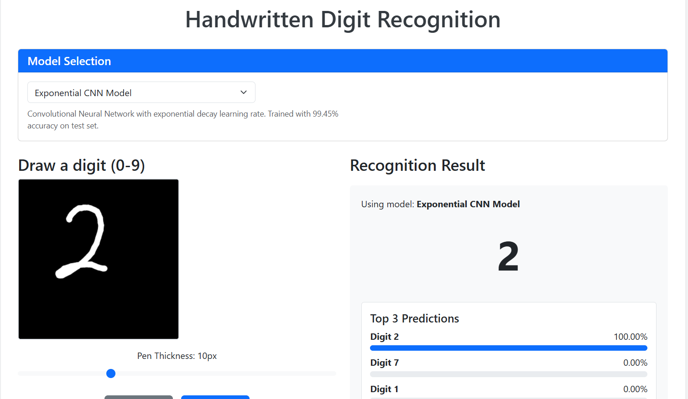

# MNIST Digit Recognition Web Application

A web-based application for handwritten digit recognition using machine learning models. This application allows users to draw digits on a canvas and get real-time predictions from multiple trained neural network models.



## Features

- **Real-time Digit Recognition**: Draw a digit and get instant predictions
- **Multiple Model Support**: Compare different machine learning models on the same input
- **Model Comparison**: See how different architectures perform side-by-side
- **Consensus Analysis**: Get insights into model agreement and confidence
- **Visualization**: View the preprocessed image that's fed to the models
- **Responsive Design**: Works on both desktop and mobile devices

## Technologies Used

- **Backend**: Flask (Python)
- **Frontend**: HTML5, CSS3, JavaScript
- **Machine Learning**: TensorFlow/Keras
- **Image Processing**: OpenCV, SciPy
- **Data Visualization**: Bootstrap progress bars

## Installation

### Prerequisites

- Python 3.8 or higher
- pip (Python package manager)
- Virtual environment (recommended)

### Setup Instructions

1. Clone the repository (or download and extract the ZIP file):
   ```
   git clone https://github.com/yourusername/mnist-web-app.git
   cd mnist-web-app
   ```

2. Create and activate a virtual environment (optional but recommended):
   ```
   python -m venv venv
   
   # On Windows
   venv\Scripts\activate
   
   # On macOS/Linux
   source venv/bin/activate
   ```

3. Install the required packages:
   ```
   pip install -r requirements.txt
   ```

4. Create the models directory and add your trained models:
   ```
   mkdir -p models
   
   # Copy your trained models to the models directory
   cp path/to/your/model.h5 models/
   ```

5. Create JSON metadata files for your models (optional but recommended):
   ```
   # Example: Create a file named models/your_model_name.json
   {
     "display_name": "User-Friendly Model Name",
     "description": "Brief description of the model architecture and performance"
   }
   ```

6. Run the application:
   ```
   python app.py
   ```

7. Open your web browser and navigate to:
   ```
   http://127.0.0.1:5000/
   ```

## Project Structure

```
mnist-web-app/
├── app.py                    # Flask application
├── requirements.txt          # Python dependencies
├── models/                   # Trained models
│   ├── model1.h5             # TensorFlow/Keras model files
│   ├── model1.json           # Model metadata (optional)
│   └── ...
├── static/                   # Static files
│   ├── css/
│   │   └── style.css         # CSS styles
│   ├── js/
│   │   └── script.js         # JavaScript functionality
│   └── img/                  # Images (optional)
└── templates/
    └── index.html            # HTML template
```

## Usage Guide

### Drawing a Digit

1. Use your mouse or finger (on touch devices) to draw a digit on the black canvas
2. Adjust the pen thickness using the slider if needed
3. The prediction will appear automatically after you finish drawing
4. Click "Clear" to erase and start over

### Selecting a Model

1. Use the dropdown menu at the top to select a specific model
2. The model description will update to show details about the selected model
3. Draw a digit to get predictions from the selected model

### Comparing Models

1. Draw a digit on the canvas
2. Click the "Compare All Models" button
3. View side-by-side results from all available models
4. The models are sorted by confidence (highest first)
5. Models that agree with the top model are highlighted in green
6. The consensus analysis shows how many models agree on the classification

## Adding New Models

To add additional models to the application:

1. Train a new model using TensorFlow/Keras
2. Save the model in H5 format to the `models` directory
3. Create a JSON metadata file with the same name as your model

Example metadata JSON file (`models/my_new_model.json`):
```json
{
  "display_name": "My New Model",
  "description": "CNN with 3 convolutional layers, batch normalization, and dropout. Trained for 25 epochs with 99.2% test accuracy."
}
```

4. Restart the application (or use the `/reload_models` endpoint)

## API Endpoints

- **`/`**: Main application page
- **`/predict`**: POST endpoint for digit prediction
- **`/list_models`**: GET endpoint to retrieve available models
- **`/reload_models`**: POST endpoint to reload models without restarting

## Model Preprocessing

The application uses a specialized preprocessing pipeline to prepare hand-drawn digits for the models:

1. Grayscale conversion
2. Gaussian blur to reduce noise
3. Binary thresholding
4. Contour detection to identify the digit
5. Center of mass alignment for accurate positioning
6. Scaling to match MNIST format (28x28 pixels)

This preprocessing ensures that hand-drawn digits closely match the MNIST format that the models were trained on.

## Performance Optimization

- Debouncing is used to avoid multiple predictions while drawing
- Images are processed on the server side for consistent results
- Model loading is done at startup to minimize prediction latency

## Troubleshooting

- **Model not found**: Ensure your model files are in the `models` directory
- **Drawing issues**: Try adjusting the pen thickness or clearing the canvas
- **Prediction errors**: Check browser console for JavaScript errors
- **Server errors**: Check the Flask application logs for details

## Future Improvements

- Data collection for further model training
- User accounts to track prediction history
- More advanced visualizations (confusion matrices, t-SNE plots)
- Support for other digit datasets beyond MNIST
- Batch upload of multiple images

## License

This project is licensed under the MIT License - see the LICENSE file for details.

## Acknowledgments

- The MNIST dataset by Yann LeCun et al.
- TensorFlow and Keras for machine learning functionality
- Flask for the web framework
- Bootstrap for frontend styling

## Contact

For questions, suggestions, or issues, please contact [joseph.arogunyo@gmail.com](mailto:joseph.arogunyo@gmail.com) or open an issue on GitHub.
Let us connect on [LinkedIn][https://www.linkedin.com/in/joseph-ishola]